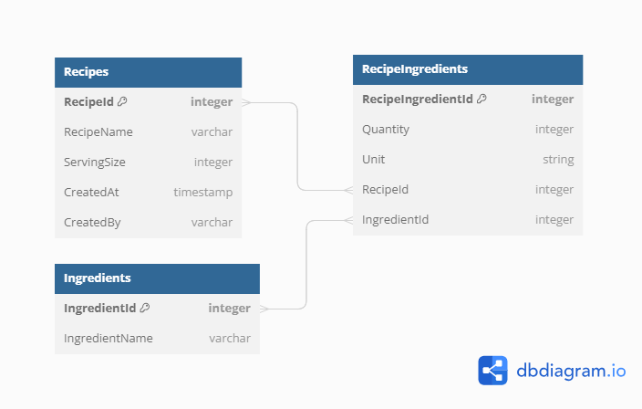

### Recipe Book DB

```sql
Table Recipes {
  RecipeId integer [primary key]
  RecipeName varchar
  ServingSize integer
  CreatedAt timestamp 
  CreatedBy varchar
}

Table Ingredients {
  IngredientId integer [primary key]
  IngredientName varchar
}

Table RecipeIngredients {
  RecipeIngredientId integer [primary key]
  Quantity integer
  Unit string
  RecipeId integer
  IngredientId integer
}
Ref: RecipeIngredients.RecipeId <> Recipes.RecipeId

Ref: RecipeIngredients.IngredientId <> Ingredients.IngredientId
```

### Recipe Book DB Diagram


https://dbdiagram.io/d/64ff250d02bd1c4a5e59f3dc